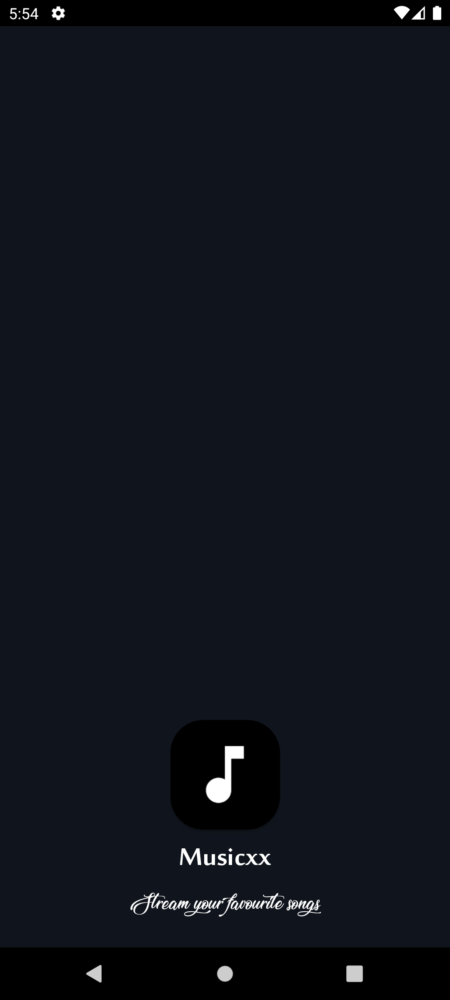
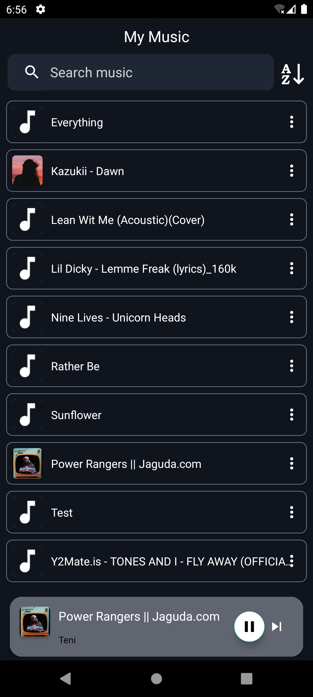
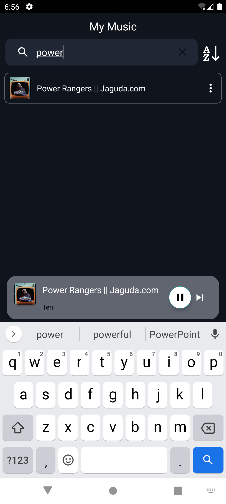
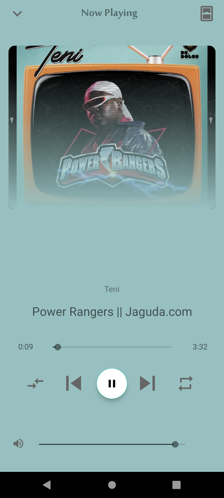

# Android-Music-Player
This sleek Android music player boasts a stunning user interface designed to enhance your music listening experience. With its intuitive design and smooth navigation, browsing your music library has never been easier.

## Features:
- Beautiful UI: Immerse yourself in a visually captivating experience with a modern and elegant user interface.
- Shake to Change Music: Shake your phone to effortlessly switch between tracks, adding an interactive twist to your music playback.
- Easy Navigation: Navigate through your music library seamlessly with intuitive controls and organized playlists.
- Easy Search: You can easily search through your music playlist, to listen to your favorite musics.
- Offline Mode: Enjoy your music library offline, perfect for when you're on the go or in areas with limited internet connectivity.

### App Images

 #### Troubleshooting

- If you encounter any build errors, check that Android Studio is updated to the latest version and that all plugins and dependencies are correctly configured.
- For database connection issues, verify that XAMPP's MySQL service is running and that your database credentials are correct in the PHP backend files.

Following these steps should help you successfully set up and run the Android application.

## Contributing

Feel free to contibute to this project , you can also add new features to make it more better , Thanks ...
